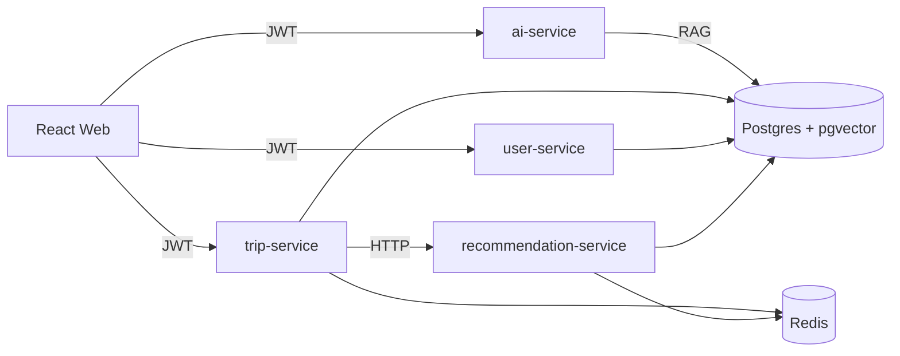

# System Design (MVP)

## Overview

Obiettivo: pianificare viaggi con output pratico e attuabile (vincoli di tempo, budget, logistica) con un layer AI che riduca hallucinations usando RAG su dati di viaggio (luoghi + travel data).

## Microservizi

## Data

- Postgres: DB principale, schemi separati per servizio (`users`, `trips`, `recommendations`, `ai`).
- pgvector: storage embeddings per retrieval.
- Redis: caching (es. suggerimenti, lookup rapidi, rate limiting futuro).

## AI Layer (RAG)

Pipeline logica:

1. Ingest: normalizzazione e chunking di travel data (luoghi, descrizioni, consigli, orari, pricing).
2. Embedding: creazione vettori e salvataggio in pgvector.
3. Retrieval: similarity search per la destinazione e i vincoli.
4. Generation: prompt con contesto + richiesta utente, output in markdown strutturato giorno-per-giorno.

## Vincoli reali (modello di ottimizzazione)

MVP: la generazione è AI-guidata e include euristiche.
Step successivo: introdurre un solver deterministico (es. constraint programming / MILP) per:

- finestre orarie (opening hours)
- tempi di trasporto reali (routing provider)
- budget per categorie (food/transport/attractions)
- preferenze e penalità (crowds, pace, walking)

